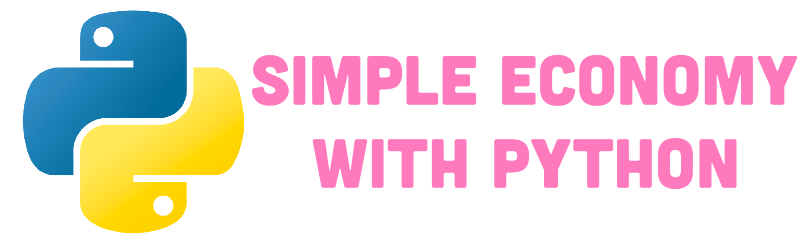
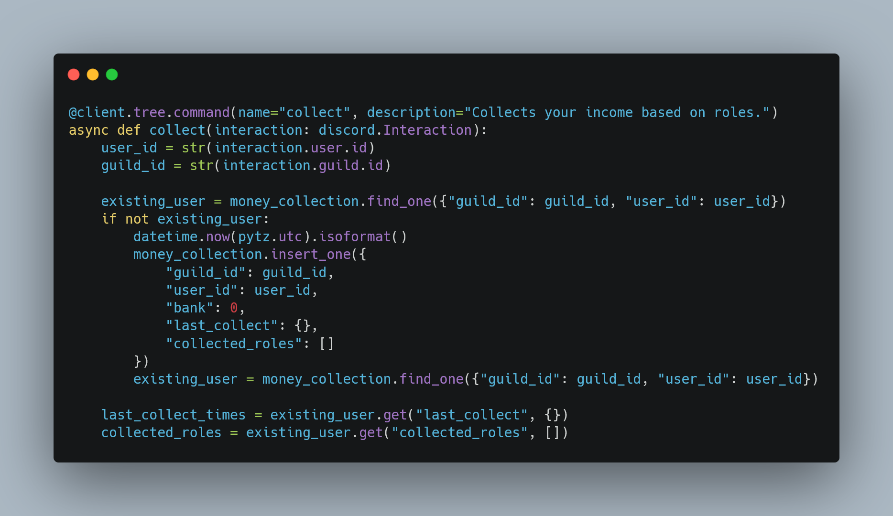

# Economy-Discord-Bot-Python
[](https://github.com/Smokez01/Economy-Discord-Bot-Python/blob/main/LICENSE) [](https://github.com/Smokez01/Economy-Discord-Bot-Python/graphs/contributors) [](https://github.com/Smokez01/Economy-Discord-Bot-Python/commits/main)



## Getting Started

This project contains multiple commands and events for a basic economy bot.

## Prerequisites

What things you need to install the software and how to install them:

Firstly, install all the needed modules, for that, you will need to install [python](https://www.python.org/downloads/) and to do that follow this tutorial

## Installation Instructions

1. #### Clone the repository
   
   ```bash
   git clone https://github.com/Smokez01/Economy-Discord-Bot-Python
   ```
   
2. #### Install Dependencies:

   ```bash
   pip install -r requirements.txt
   ```

3. #### Configure Settings
   - Create a file with the name ```.env```.
   - Edit the ```.env``` to add your bot token.
     
   ```bash
   DISCORD_TOKEN=your token
   ```
   

## Usage

If you would like to use this bot, personally or commercially, please give me ([Smokez01](https://github.com/Smokez01)) credit.

## Code Showcase



## Commands

1. ```add-money```: Adds a specified amount of money to a user's balance.
2. ```remove-money```: Removes a specified amount of money from a user's balance.
3. ```withdraw```: Withdraws money from a user's balance.
4. ```deposit```: Deposits money into a user's balance.
5. ```money```: Displays the current balance of a user.
6. ```pay```: Sends money from one user to another.
7. ```reset-money```: Resets a user's money balance to zero.
8. ```role-income```: Sets or adjusts the income for a specific user role.
9. ```set-income```: Sets a specific amount of income for a user.
10. ```collect```: Collects earned money.

## Built With

[discord.py](https://discordpy.readthedocs.io/en/stable/) - The library used

[Python](https://www.python.org/) - The Runtime

## Contributing
Any pull request's are welcome!

## Issues

If you have any issue, please don't hesitate to make a [issue](https://github.com/Smokez01/Economy-Discord-Bot-Python/issues), I will gladly take a look at it and try to fix it!

## Authors

Smokez01 - Initial work & all the project - [Smokez01](https://github.com/Smokez01)

## License

This project is licensed under the MIT License - see the [LICENSE](https://github.com/Smokez01/Economy-Discord-Bot-Python/blob/main/LICENSE) file for details
